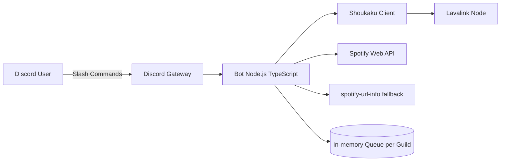
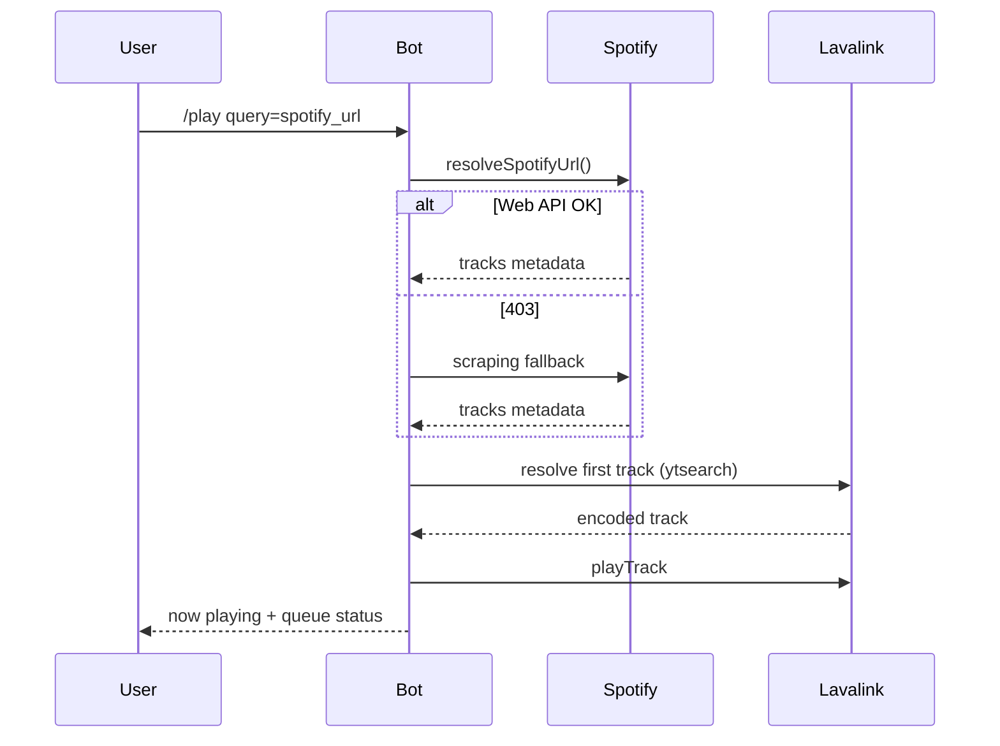

# 🎵 Discord Music Bot

> Bot de música para Discord con soporte de **YouTube + Spotify**, cola avanzada por servidor, reproducción resiliente vía **Lavalink**, y comandos slash listos para producción.

<p align="left">
  
  
  
  
  
  
</p>

**Estado del proyecto:** ✅ Funcional para uso real en servidores Discord; requiere hardening para entornos enterprise (observabilidad, tests automáticos y CI/CD).

---

## Tabla de Contenidos

- [1) Overview](#1-overview)
- [2) Features](#2-features)
- [3) Tech Stack](#3-tech-stack)
- [4) Arquitectura](#4-arquitectura)
- [5) Estructura del Proyecto](#5-estructura-del-proyecto)
- [6) Instalación](#6-instalación)
- [7) Variables de Entorno](#7-variables-de-entorno)
- [8) Uso](#8-uso)
- [9) API Documentation (Slash Commands)](#9-api-documentation-slash-commands)
- [10) Base de Datos](#10-base-de-datos)
- [11) Testing](#11-testing)
- [12) Deployment](#12-deployment)
- [13) Performance](#13-performance)
- [14) Seguridad](#14-seguridad)
- [15) Roadmap](#15-roadmap)
- [16) Contributing](#16-contributing)
- [17) License](#17-license)
- [18) Créditos](#18-créditos)
- [19) Debilidades Detectadas y Mejoras Recomendadas](#19-debilidades-detectadas-y-mejoras-recomendadas)
- [20) Versión resumida para recruiters](#20-versión-resumida-para-recruiters)
- [21) Versión ultra técnica para developers](#21-versión-ultra-técnica-para-developers)
- [22) GitHub About + Topics sugeridos](#22-github-about--topics-sugeridos)
- [23) Estructura ideal de documentación adicional (/docs)](#23-estructura-ideal-de-documentación-adicional-docs)

---

## 1) Overview

Este proyecto implementa un bot de música para Discord centrado en **fiabilidad de reproducción**, **buena UX en comandos slash** y compatibilidad híbrida de fuentes:

- **YouTube** (URL directa o búsqueda por texto).
- **Spotify** (track, playlist y álbum) resuelto a audio reproducible por YouTube.

### Problema que resuelve

Muchos bots de música se rompen al manejar playlists grandes, desconexiones de voz o restricciones de APIs. Este bot aplica:

- cola por guild,
- reconexión/gestión de estado de player,
- fallback inteligente en Spotify,
- auto-pausa / auto-disconnect por inactividad.

### Caso de uso real

Comunidades de Discord (gaming, estudio, coworking, stream teams) que requieren un bot estable, con comandos modernos y control fino de reproducción.

### Público objetivo

- Devs que quieran desplegar su propio bot musical.
- Maintainers open source que busquen base TypeScript + Lavalink limpia.
- Recruiters/portfolios: demuestra integración de APIs externas, diseño orientado a eventos y manejo de estado en tiempo real.

---

## 2) Features

### Funcionales

- Reproducción por `/play` con búsqueda y URLs.
- Soporte Spotify para:
  - `track`
  - `playlist` (con paginación)
  - `album` (con paginación)
- Cola con vista (`/queue`) y now playing (`/nowplaying`) con barra de progreso.
- Controles de playback:
  - `/skip`
  - `/stop`
  - `/pause`
  - `/resume`
  - `/seek`
- Modo aleatorio (`/shuffle`) y loop infinito de playlist (`/loopplaylist`).
- Auto-desconexión por inactividad y reanudación automática cuando vuelve un usuario al canal.

### Técnicas

- Arquitectura event-driven (Discord events + Lavalink player events).
- Caché temporal de resoluciones de tracks (TTL 30 min).
- Lazy resolution de pistas pendientes de Spotify para acelerar el enqueue inicial.
- Fallback de Spotify Web API a scraping (`spotify-url-info`) cuando hay 403 por restricciones de Development Mode.
- Gestión de estado por servidor (guild) en memoria.

---

## 3) Tech Stack

| Capa | Tecnología |
|---|---|
| Lenguaje | TypeScript |
| Runtime | Node.js (CommonJS) |
| Bot Framework | discord.js v14 |
| Audio Orchestration | Shoukaku v4 |
| Voice Backend | Lavalink |
| Integración Spotify | spotify-web-api-node + spotify-url-info |
| Config | dotenv |
| Tooling | ts-node, TypeScript compiler |

### Backend

No existe frontend web; el backend es un proceso Node long-running que se conecta a Discord Gateway y a Lavalink.

### Database

No hay base de datos persistente actualmente. El estado se mantiene in-memory (`Map` por guild).

### Infra/DevOps

- No hay Dockerfile en el repo (aún).
- No hay workflows de GitHub Actions (aún).
- Deploy manual orientado a VM/VPS + Lavalink externo/local.

### Testing

No hay suite de testing implementada actualmente.

---

## 4) Arquitectura

### Arquitectura general



### Flujo de datos `/play` con Spotify



### Patrones usados

- **Event-driven:** `interactionCreate`, `voiceStateUpdate`, `player.on('end')`.
- **In-memory Repository Pattern (simple):** `queues: Map<string, GuildQueue>`.
- **Graceful degradation:** Spotify API -> fallback scraper.
- **Lazy loading:** metadata de Spotify se transforma a tracks reales solo al reproducirse.

### Decisiones técnicas importantes

1. **Lavalink + Shoukaku** para desacoplar streaming de Discord de la app principal.
2. **QueueItem híbrido** (`track` o `pending`) para balancear latencia y consumo de API.
3. **Auto-disconnect diferido** (3 min) para UX más amigable cuando la cola termina.

---

## 5) Estructura del Proyecto

```bash
src/
├── index.ts                 # bootstrap del bot, eventos Discord, dispatcher de comandos
├── deploy-commands.ts       # registro de slash commands en guild
├── lavalink/
│   └── client.ts            # inicialización y listeners de Shoukaku/Lavalink
├── music/
│   ├── player.ts            # núcleo de reproducción, cola, caché, toggles, seek, nowplaying
│   ├── queue.ts             # tipos de estado y store en memoria
│   ├── spotify.ts           # resolución Spotify + fallback
│   └── skip.ts              # comando legacy (no integrado en router actual)
└── commands/                # comandos legacy/modulares (parcialmente no usados en runtime actual)
    ├── ping.ts
    ├── shuffle.ts
    └── loopplaylist.ts
```

> Nota: la lógica efectiva de comandos corre principalmente en `src/index.ts`; la carpeta `src/commands` contiene implementaciones modulares que no están conectadas al flujo principal actual.

---

## 6) Instalación

### Requisitos previos

- Node.js 22+ recomendado.
- Java 17+ para ejecutar Lavalink.
- Un bot de Discord con intents habilitados.
- Credenciales Spotify (opcional pero recomendado para URLs Spotify).

### Clonado e instalación

```bash
git clone https://github.com/Dregxmoon/discord-music-bot.git
cd discord-music-bot
npm install
```

### Variables de entorno

Crea `.env` en la raíz (ver tabla completa abajo).

### Registrar comandos slash

```bash
npx ts-node src/deploy-commands.ts
```

### Ejecutar Lavalink (local)

```bash
java -jar Lavalink.jar
```

### Ejecutar bot en local

```bash
npx ts-node src/index.ts
```

### Migraciones / Seeds

No aplica (sin base de datos).

### Docker

No incluido actualmente en el repositorio (ver roadmap para Dockerización recomendada).

---

## 7) Variables de Entorno

| Variable | Descripción | Requerida | Ejemplo |
|---|---|---:|---|
| `DISCORD_TOKEN` | Token del bot de Discord | ✅ | `MTAx...` |
| `CLIENT_ID` | Application ID del bot para registrar comandos | ✅ | `123456789012345678` |
| `GUILD_ID` | Guild destino para comandos slash (modo guild) | ✅ | `987654321098765432` |
| `LAVALINK_HOST` | Host del nodo Lavalink | ✅ | `localhost` |
| `LAVALINK_PORT` | Puerto de Lavalink | ✅ | `2333` |
| `LAVALINK_PASSWORD` | Password de Lavalink | ✅ | `youshallnotpass` |
| `SPOTIFY_CLIENT_ID` | Client ID de Spotify API | ⚠️ (recomendado) | `abc123` |
| `SPOTIFY_CLIENT_SECRET` | Client Secret de Spotify API | ⚠️ (recomendado) | `def456` |

---

## 8) Uso

### Comandos principales

- `/play query:<texto|url>`
- `/skip`
- `/stop`
- `/queue`
- `/nowplaying`
- `/pause`
- `/resume`
- `/seek position:<1:30|90>`
- `/shuffle`
- `/loopplaylist`
- `/ping`

### Ejemplos reales

```text
/play query: daft punk one more time
/play query: https://www.youtube.com/watch?v=dQw4w9WgXcQ
/play query: https://open.spotify.com/playlist/...
/seek position: 2:15
```

### Respuesta típica del bot

```text
🎵 Song Title [3:42] — 📋 4 en cola
```

---

## 9) API Documentation (Slash Commands)

> No hay API HTTP REST. La “API” del sistema es vía comandos slash de Discord.

| Command | Params | Auth | Descripción |
|---|---|---|---|
| `/play` | `query:string` | Usuario en voice channel | Encola/reproduce canción, URL YouTube o Spotify |
| `/skip` | — | Guild command | Salta la canción actual |
| `/stop` | — | Guild command | Detiene reproducción y limpia cola |
| `/queue` | — | Guild command | Lista hasta 20 próximas canciones |
| `/pause` | — | Guild command | Pausa reproducción |
| `/resume` | — | Guild command | Reanuda reproducción |
| `/seek` | `position:string` | Guild command | Salta a timestamp específico |
| `/nowplaying` | — | Guild command | Muestra tema actual + progreso |
| `/shuffle` | — | Guild command | Toggle modo aleatorio |
| `/loopplaylist` | — | Guild command | Toggle loop infinito |
| `/ping` | — | Guild command | Health check simple |

---

## 10) Base de Datos

Actualmente no se utiliza DB.

### Modelo de estado en memoria

- `queues: Map<guildId, GuildQueue>`
- `GuildQueue` contiene player, tracks pendientes, historial, flags y estado temporal de reproducción.

**Implicación:** reiniciar el proceso pierde todas las colas activas.

---

## 11) Testing

Estado actual:

- ❌ No hay tests unitarios/integración/end-to-end.
- ❌ Script `npm test` no implementado.

Recomendado:

- `vitest` para unit tests (`spotify.ts`, utilidades de duración/progreso).
- tests de integración con mocks de Shoukaku/Discord interactions.
- smoke tests en CI antes de deploy.

---

## 12) Deployment

### Docker

Pendiente en repo. Propuesta rápida:

- contenedor del bot (Node)
- contenedor Lavalink
- red interna compartida
- secretos por `.env`/secret manager

### Railway / Render / Fly.io

Viable para bot + Lavalink separado. Asegurar:

- proceso always-on,
- auto-restart,
- logs centralizados.

### AWS

- Bot en ECS/Fargate o EC2.
- Lavalink en servicio independiente con métricas.
- Secrets Manager para tokens.

### CI/CD (GitHub Actions)

No hay pipelines hoy. Recomendación mínima:

1. `npm ci`
2. `npm run typecheck`
3. tests
4. build
5. deploy condicionado por rama/tag

---

## 13) Performance

Optimizaciones presentes:

- caché TTL de resoluciones Lavalink (reduce roundtrips).
- lazy resolution para playlists de Spotify (menos latencia inicial).
- límite de cola de 100 para controlar memoria y tiempos.

Mejoras futuras:

- LRU cache con límites de tamaño.
- métricas (p95 resolve time, track start latency).
- sharding del bot para alta escala de guilds.

---

## 14) Seguridad

Medidas actuales:

- secretos por variables de entorno.
- no hardcode de tokens.

Riesgos a atender:

- falta de rate limiting por usuario/comando.
- validación de entrada aún mejorable (`/seek`, querys largas).
- ausencia de auditoría de dependencias y SAST.

Checklist recomendado:

- `npm audit` + Dependabot.
- rotación periódica de tokens.
- Principle of Least Privilege en permisos del bot.

---

## 15) Roadmap

- [ ] Añadir `Dockerfile` + `docker-compose` (bot + lavalink).
- [ ] Implementar test suite (unit + integration).
- [ ] Agregar GitHub Actions CI (lint/typecheck/test/build).
- [ ] Persistencia opcional (Redis/PostgreSQL) para colas y preferencias.
- [ ] Comandos adicionales (`/remove`, `/clear`, `/volume`, `/previous`).
- [ ] Telemetría y observabilidad (OpenTelemetry + structured logs).
- [ ] Internacionalización de respuestas (ES/EN).

---

## 16) Contributing

1. Haz fork del repo.
2. Crea una rama `feature/<nombre>` o `fix/<nombre>`.
3. Mantén cambios pequeños y atómicos.
4. Agrega tests para lógica nueva/crítica.
5. Ejecuta typecheck antes de abrir PR.
6. Describe claramente contexto, decisión técnica y trade-offs.

### Convenciones sugeridas

- commits con Conventional Commits.
- separar lógica de dominio (music) de wiring (discord events).
- evitar side effects globales salvo bootstrap.

---

## 17) License

ISC License.

---

## 18) Créditos

- [discord.js](https://discord.js.org/)
- [Shoukaku](https://github.com/shipgirlproject/Shoukaku)
- [Lavalink](https://github.com/lavalink-devs/Lavalink)
- [spotify-web-api-node](https://github.com/thelinmichael/spotify-web-api-node)

---

## 19) Debilidades Detectadas y Mejoras Recomendadas

### Debilidades actuales

1. No hay pipeline de calidad automatizado.
2. No hay persistencia de estado.
3. `src/commands/*` y `src/music/skip.ts` están desalineados del dispatcher principal (deuda técnica).
4. `strict: false` en TypeScript reduce garantías en runtime.
5. Falta documentación de operación (runbook, troubleshooting).

### Refactors importantes

- Crear `CommandRegistry` central con handlers desacoplados por archivo.
- Separar capa `music-core` de capa `discord-adapter`.
- Introducir interfaces para nodos externos (Spotify/Lavalink) y facilitar testing.
- Mover mensajes hardcoded a un módulo i18n.

### Escalabilidad futura

- Redis para shared queue state multi-instance.
- Discord sharding para miles de guilds.
- Node pools de Lavalink con failover.
- Circuit breakers y backoff en integraciones externas.

### DX (Developer Experience)

- añadir scripts:
  - `dev`, `build`, `start`, `typecheck`, `lint`, `test`.
- ESLint + Prettier + Husky + lint-staged.
- `.env.example` completo.
- documentación de onboarding en `/docs`.

---

## 20) Versión resumida para recruiters

**Discord Music Bot** es un proyecto TypeScript orientado a producción que integra Discord Gateway, Lavalink y Spotify para ofrecer reproducción musical estable en tiempo real. Implementa arquitectura event-driven, cola por servidor, fallback inteligente de APIs, auto-disconnect por inactividad y controles avanzados (`pause/resume/seek/shuffle/loop`). Demuestra habilidades en integración de servicios externos, diseño de estado concurrente y experiencia de usuario en bots de comunidad.

---

## 21) Versión ultra técnica para developers

- Runtime long-lived Node process con `discord.js` intents mínimos (`Guilds`, `GuildVoiceStates`).
- Resolución de audio delegada a Lavalink mediante Shoukaku v4.
- `QueueItem` soporta `track eager` y `pending SpotifyMeta` (lazy resolve).
- Estrategia de resolución:
  - cache lookup
  - up to 3 retries primary query
  - fallback query
- Eventos críticos:
  - `voiceStateUpdate` -> auto pause/disconnect scheduling
  - `player.end` -> `playNext`
  - `player.exception` -> skip resiliente
- Control temporal de playback calculado localmente (`startedAt`, `pausedAt`) para `nowplaying` y `seek`.
- Fallback Spotify 403 -> scraper para sortear limitaciones de Development Mode.

---

## 22) GitHub About + Topics sugeridos

### About (corto)

`Discord music bot in TypeScript with Lavalink + Spotify support, resilient queue handling, and advanced slash commands.`

### Topics recomendados

- `discord-bot`
- `music-bot`
- `typescript`
- `discord-js`
- `lavalink`
- `shoukaku`
- `spotify-api`
- `youtube`
- `nodejs`
- `open-source`

---

## 23) Estructura ideal de documentación adicional (/docs)

```bash
docs/
├── architecture/
│   ├── overview.md
│   ├── queue-lifecycle.md
│   └── spotify-resolution-flow.md
├── operations/
│   ├── runbook.md
│   ├── troubleshooting.md
│   └── incident-response.md
├── setup/
│   ├── local-development.md
│   ├── lavalink-setup.md
│   └── environment-variables.md
├── quality/
│   ├── testing-strategy.md
│   └── code-style.md
└── adr/
    ├── 0001-use-lavalink.md
    ├── 0002-inmemory-queue.md
    └── 0003-spotify-fallback-strategy.md
```

---

Si quieres, puedo entregarte en un siguiente paso:

- `README` bilingüe ES/EN,
- `CONTRIBUTING.md` completo,
- `docs/architecture/*.md` ya redactados,
- y una propuesta de `docker-compose` + GitHub Actions lista para usar.
